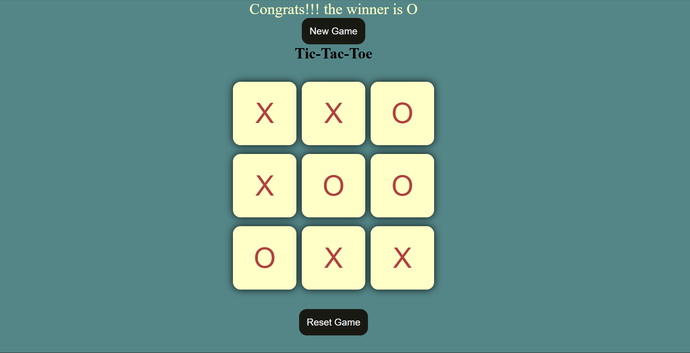

Here’s the `README.md` code for your project:

```markdown
# Tic Tac Toe Game 🎮

A classic Tic Tac Toe game built using **HTML**, **CSS**, and **JavaScript**. The game is simple, fun, and allows two players to play against each other in a friendly competition to see who gets three in a row first!

---

## 🎯 Features
- **Interactive Gameplay:** Two-player mode for real-time fun.
- **Dynamic Updates:** Displays the winner or a draw at the end of the game.
- **Responsive Design:** A visually appealing and user-friendly interface.
- **Restart Option:** Quickly start a new game without refreshing the page.

---

## 📸 Screenshot


---

## 🚀 How to Run the Project
1. Clone the repository:
   ```bash
   git clone https://github.com/your-username/tic-tac-toe.git
   ```
2. Navigate to the project directory:
   ```bash
   cd tic-tac-toe
   ```
3. Open the `app.html` file in your favorite browser.

---

## 🛠️ Technologies Used
- **HTML**: Markup for the structure of the game.
- **CSS**: Styling to enhance the appearance of the game.
- **JavaScript**: Logic to handle the game mechanics and interactivity.

---

## 📄 Game Rules
1. The game is played on a 3x3 grid.
2. Players take turns to place their marker (`X` or `O`) in an empty cell.
3. The first player to get three markers in a row (vertically, horizontally, or diagonally) wins.
4. If all cells are filled and no player has three in a row, the game ends in a draw.

---


## 🖋️ Author
- **Shahriar Farhan Karim**  
  Connect with me on [GitHub](https://github.com/your-farhan065) and [LinkedIn](https://www.linkedin.com/in/shahriar-farhan-karim-02a9612b7//).

---

## 📢 Contributions
Contributions, issues, and feature requests are welcome! Feel free to fork this project and submit pull requests.

---

## 🙏 Acknowledgments
Thanks for checking out this project! If you enjoyed it or found it helpful, consider giving it a ⭐ on GitHub.
```
